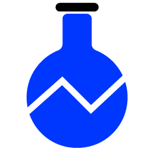

#  Optimizely Labs

Optimizely Labs is a collection of tutorials ("labs") for working with Optimizely data and developer tools.

Each lab contains a **focused** combination of documentation and code demonstrating how to solve a specific problem with Optimizely data or developer tools.  For example, [this lab](labs/query-enriched-event-data-with-spark) contains instructions for loading and querying [Optimizely Enriched Event data](https://docs.developers.optimizely.com/web/docs/enriched-events-export) using [Apache Spark](https://spark.apache.org/).

Labs are **self-contained**, so all of the instructions and resources needed to run executable code can be found in the lab directory.  They're also **open-sourced** under the [Apache 2.0 license](http://www.apache.org/licenses/LICENSE-2.0), so you're free to modify and use them to solve problems in your own way.

## Resources

- Optimizely Labs page - (Coming soon!) A handy website for exploring, reading, and downloading lab code.
- [Labs directory](labs) - The source of truth for lab content.
- [Contributing guide](CONTRIBUTING.md) - Want to contribute to this repository?  Start here.

