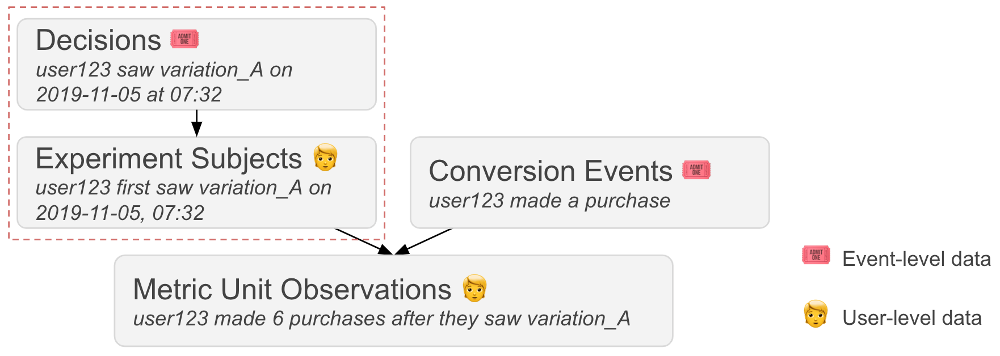

# Computing Experiment Datasets #1: Experiment Subjects

This Lab is part of a multi-part series focused on computing useful experiment datasets. In this Lab, we'll use [PySpark](https://spark.apache.org/docs/latest/api/python/index.html) to compute _experiment subjects_ from [Optimizely Enriched Event](https://docs.developers.optimizely.com/optimizely-data/docs/enriched-events-export) ["Decision"](https://docs.developers.optimizely.com/optimizely-data/docs/enriched-events-data-specification#decisions-2) data.



**Experiment subjects** are the individual units that are exposed to a control or treatment in the course of an online experiment.  In most online experiments, subjects are website visitors or app users. However, depending on your experiment design, treatments may also be applied to individual user sessions, service requests, search queries, etc. 
   
## Running this notebook

There are several ways to run this notebook locally:
- Using the `run.sh` script
- Using [Docker](https://www.docker.com/) with the `run-docker.sh` script
- Manually, using the `conda` CLI

### Running the notebook with `run.sh`

You can use the `run.sh` script to build your environment and run this notebook with a single command.

#### Prerequisite: conda (version 4.4+)

[Anaconda]: https://www.anaconda.com/distribution/
[Miniconda]: https://docs.conda.io/en/latest/miniconda.html

You can install the `conda` CLI by installing [Anaconda] or [Miniconda].

#### Running Jupyter Lab

This lab directory contains a handy script for building your conda environment and running Jupyter Lab.  To run it, simply use

```sh
bash bin/run.sh
```

That's it, you're done!

### Running this notebook with Docker

If you have [Docker](https://www.docker.com/) installed, you can run PySpark and Jupyter Lab without installing any other dependencies.

Execute `run-docker.sh` in the `./bin` directory to open Jupyter Lab in a Docker container:

```sh
bash bin/run-docker.sh
```

**Note:** Docker makes it easy to get started with PySpark, but it adds overhead and may require [additional configuration](https://docs.docker.com/config/containers/resource_constraints/) to handle large workloads.  

### Running this notebook manually

If you prefer to build and activate your conda environment manually, you can use the `conda` CLI and the environment specification files in the `./lab_env` directory to do so.

#### Prerequisite: conda (version 4.4+)

[Anaconda]: https://www.anaconda.com/distribution/
[Miniconda]: https://docs.conda.io/en/latest/miniconda.html

You can install the `conda` CLI by installing [Anaconda] or [Miniconda].

#### Building and activating your Aanconda environment

Start by building (or updating) and activating your anaconda environment.  This step will install [OpenJDK](https://openjdk.java.net/), [PySpark](https://spark.apache.org/docs/latest/api/python/pyspark.html), [Jupyter Lab](https://jupyter.org/), and other necessary dependencies.

```sh
conda env update --file lab_env/base.yml --name optimizelylabs
conda env update --file lab_env/labs.yml --name optimizelylabs
conda activate optimizelylabs
```

Next, install a jupyter kernel for this environment:

```sh
python -m ipykernel install --user \
    --name optimizelylabs \
    --display-name="Python 3 (Optimizely Labs Environment)"
```

Finally, start Jupyter Lab in your working directory:

```sh
jupyter lab .
```

## Specifying a custom data directory

The notebook in this lab will load Enriched Event data from `example_data/` in the lab directory.  If you wish to load data from another directory, you can use the `OPTIMIZELY_DATA_DIR` environment variable.  For example:

```sh
export OPTIMIZELY_DATA_DIR=~/optimizely_data
```

Once `OPTIMIZELY_DATA_DIR` has been set, launch Jupyter Lab using one of the approaches described above.  The Lab notebook should load data from your custom directory.