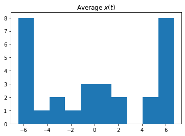
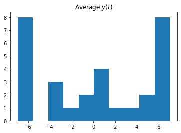

# The Lorenz Differential Equations

Before we start, we import some preliminary libraries. We will also import (below) the accompanying `lorenz.py` file, which contains the actual solver and plotting routine.


```python
%matplotlib inline
from ipywidgets import interactive, fixed
```

We explore the Lorenz system of differential equations:

$$
\begin{aligned}
\dot{x} & = \sigma(y-x) \\
\dot{y} & = \rho x - y - xz \\
\dot{z} & = -\beta z + xy
\end{aligned}
$$

Let's change (\\(\sigma\\), \\(\beta\\), \\(\rho\\)) with ipywidgets and examine the trajectories.


```python
from lorenz import solve_lorenz
w=interactive(solve_lorenz,sigma=(0.0,50.0),rho=(0.0,50.0))
w
```


    interactive(children=(FloatSlider(value=10.0, description='sigma', max=50.0), FloatSlider(value=2.666666666666…


For the default set of parameters, we see the trajectories swirling around two points, called attractors. 

The object returned by `interactive` is a `Widget` object and it has attributes that contain the current result and arguments:


```python
t, x_t = w.result
```


```python
w.kwargs
```


    {'sigma': 10.0, 'beta': 2.6666666666666665, 'rho': 28.0}


After interacting with the system, we can take the result and perform further computations. In this case, we compute the average positions in \\(x\\), \\(y\\) and \\(z\\).


```python
xyz_avg = x_t.mean(axis=1)
```


```python
xyz_avg.shape
```


    (30, 3)


Creating histograms of the average positions (across different trajectories) show that, on average, the trajectories swirl about the attractors.


```python
from matplotlib import pyplot as plt
```


```python
plt.hist(xyz_avg[:,0])
plt.title('Average $x(t)$');
```





```python
plt.hist(xyz_avg[:,1])
plt.title('Average $y(t)$');
```





```python

```
